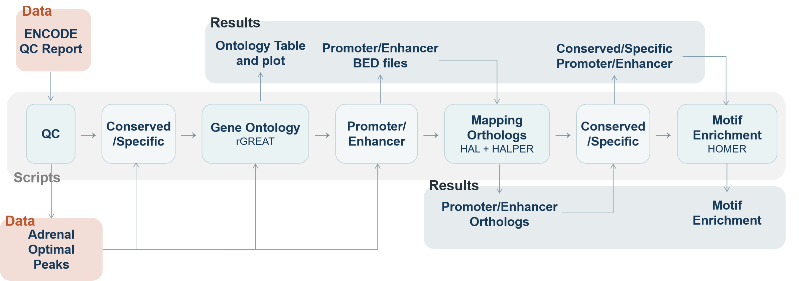

# Adrenal_gland-Uterus-OCR-Analysis

03-713: Bioinformatics Data Integration Practicum, Spring 2026

Team members: Xinyi Li, Jimmy Lee, Yu Hsin Chen

## Project Overview

This project compares open chromatin regions (OCRs) between adrenal gland and uterus in human and mouse ATAC-seq datasets. The current repository includes:

- QC summaries for all four datasets
- IDR optimal peak sets
- `rGREAT` functional enrichment analysis on optimal OCRs
- Promoter/enhancer partitioning for adrenal gland OCRs
- Cross-species OCR mapping with HAL/HALPER
- Species-conserved and species-specific peak classification (Mouse→Human)
- HOMER motif enrichment analysis for species-specific vs. conserved OCR subsets

This pipeline was designed primarily for a SLURM-based Linux environment, especially for the HALPER and HOMER job-submission steps. At the same time, each stage can also be run independently by executing the corresponding script directly.

Repository structure:

```text
.
├── data/
│   ├── qc_html/                    ENCODE-style QC HTML reports
│   ├── idr_Optimal_Peaks/          optimal peak sets used for downstream analyses
│   └── Promoters_and_Enhancers/    promoter/enhancer split peak sets and lifted results
├── scripts/
│   ├── 1a_qc_html_report.py        threshold-annotated QC HTML report generator
│   ├── 1b_make_qc_table.py         QC summary table builder and terminal summary printer
│   ├── 2a_rGREAT.R                 rGREAT enrichment runner
│   ├── 2b_rGREAT_plot.R            rGREAT result plotting script
│   ├── 3a_call_adrenal_promoter_enhancer.sh
│   │                                  promoter/enhancer partitioning for adrenal OCRs
│   ├── 3b_run_hal_promoter_enhancer.sh
│   │                                  HALPER liftover submission script
│   ├── 4a_classify_conserved_peaks.sh
│   │                                  conserved vs. species-specific peak classification
│   └── 5a_run_HOMER.sh             HOMER motif enrichment script
└── results/
    ├── qc/                         QC tables, checked HTML reports, and interpretation
    ├── rGREAT/                     GO enrichment tables and dot plots
    ├── Enhancer_and_Promoters/     adrenal promoter/enhancer summary and conserved/specific peak calls
    └── HOMER/                      motif enrichment results for all four specific-vs-conserved comparisons
```

Pipeline design:



## Dependencies

The analyses in this repository depend on the following software and resources:

- `Python 3.11` 
- `R` for `rGREAT` analysis and plotting, R packages: `rGREAT`, `GenomicRanges`, `IRanges`, `ggplot2`
- `bedtools` for promoter/enhancer partitioning and conserved/specific peak classification
- `HAL` / `halLiftover` for working with multi-species genome alignments
- `HALPER` for cross-species OCR mapping post-processing
- `HOMER` for motif enrichment analysis
- local genome FASTA files such as `hg38.fa` and `mm10.fa`
- TSS annotation BED files for human and mouse
- access to a multi-species `.hal` alignment file

Optional but recommended for the full workflow:

- a Linux environment
- a `conda` installation for managing Python, R, and command-line dependencies
- a SLURM environment for the job-submission scripts `scripts/3b_run_hal_promoter_enhancer.sh` and `scripts/5a_run_HOMER.sh`

## Quick Start

The instructions below assume you are running in a Linux environment.

### 1. Clone the repository

```bash
git clone https://github.com/BioinformaticsDataPracticum2026/Adrenal_gland-Uterus-OCR-Analysis.git
cd Adrenal_gland-Uterus-OCR-Analysis
```

### 2. Create and activate a conda environment

The Python scripts in this repository currently use only the Python standard library, so there is no required `requirements.txt` at the moment. We recommend using a conda environment to keep the Python, R, and command-line dependencies together.

```bash
conda create -n adrenal-ocr-analysis python=3.11 -y
conda activate adrenal-ocr-analysis
conda install -c conda-forge -c bioconda pip r-base bedtools -y                        
```

### 3. Install analysis dependencies

Install the required R packages:

```bash
Rscript -e 'install.packages("BiocManager", repos="https://cloud.r-project.org")'
Rscript -e 'install.packages("ggplot2", repos="https://cloud.r-project.org")'
Rscript -e 'BiocManager::install("rGREAT", ask=FALSE, update=FALSE, INSTALL_opts="--no-multiarch")'
```

Install HALPER and the post-processing helper script:

```bash
git clone https://github.com/pfenninglab/halLiftover-postprocessing.git
```

Install HOMER:

```bash
mkdir homer
cd homer
wget http://homer.ucsd.edu/homer/configureHomer.pl
perl configureHomer.pl -install
cd ..
```

You can also refer to the official project instructions:

- HAL / halLiftover: https://github.com/ComparativeGenomicsToolkit/hal
- HALPER post-processing: https://github.com/pfenninglab/halLiftover-postprocessing
- HOMER: http://homer.ucsd.edu/homer/
- bedtools: https://bedtools.readthedocs.io/
- Bioconductor `rGREAT`: https://bioconductor.org/packages/rGREAT/
- Bioconductor `GenomicRanges`: https://bioconductor.org/packages/GenomicRanges/
- Bioconductor `IRanges`: https://bioconductor.org/packages/IRanges/
- `ggplot2`: https://ggplot2.tidyverse.org/

### 4. Configure local paths for external resources

Some scripts use repository-relative input/output paths, but still require external resources that you must provide in your environment. The current repository already includes part of the initial input data and several intermediate results, so some scripts can be run directly without reproducing every upstream step from scratch.

Update these variables before running the corresponding scripts:

- `scripts/3a_call_adrenal_promoter_enhancer.sh`
  - `HUMAN_TSS`
  - `HUMAN_GENOME_INDEX`
  - `MOUSE_TSS`
  - `MOUSE_GENOME_INDEX`
- `scripts/3b_run_hal_promoter_enhancer.sh`
  - `HALPER_SCRIPT`
  - `HAL`
- `scripts/5a_run_HOMER.sh`
  - `HUMAN_FA`
  - `MOUSE_FA`
  - the `export PATH=.../HOMER/bin:$PATH` line

### 5. Run the pipeline

From the repository root:

```bash
# QC: annotate the QC HTML reports and build the QC summary table
python scripts/1a_qc_html_report.py && python scripts/1b_make_qc_table.py --print-summary

# Functional enrichment and plots
Rscript scripts/2a_rGREAT.R
Rscript scripts/2b_rGREAT_plot.R

# Partition adrenal OCRs into promoter and enhancer sets
bash scripts/3a_call_adrenal_promoter_enhancer.sh

# Submit HALPER liftover jobs
bash scripts/3b_run_hal_promoter_enhancer.sh

# Classify conserved and species-specific peaks
bash scripts/4a_classify_conserved_peaks.sh

# Run HOMER motif enrichment
sbatch scripts/5a_run_HOMER.sh
```

### 6. Check outputs

Main outputs are written to:

- `results/qc/`
- `results/rGREAT/`
- `results/Enhancer_and_Promoters/`
- `results/HOMER/`

## 1. Evaluate data quality

QC summaries are stored in `results/qc/`:

- `*_checked.html`: threshold-annotated QC HTML reports generated from the raw ENCODE-style reports
- `qc_summary_table.tsv` and `qc_summary_table.md`: combined metrics table across all four datasets

Relevant scripts:

- `scripts/1a_qc_html_report.py`: enhances the ENCODE-style QC HTML reports with threshold annotations
- `scripts/1b_make_qc_table.py`: parses the QC HTML reports, builds the final QC summary table, and can print a concise terminal summary including TSS enrichment, pooled FRiP, NRF/PBC metrics, and IDR peak counts

To run:

```bash
# Enhance QC HTML reports and write annotated HTML files to results/qc
python scripts/1a_qc_html_report.py

# Build combined QC summary table from the HTML reports in data/qc_html
# and print a concise QC summary to the terminal
python scripts/1b_make_qc_table.py --print-summary

# Run both QC scripts in one command
# PowerShell:
python scripts/1a_qc_html_report.py; python scripts/1b_make_qc_table.py --print-summary

# bash:
python scripts/1a_qc_html_report.py && python scripts/1b_make_qc_table.py --print-summary
```

`1a_qc_html_report.py` reads QC HTML files from `data/qc_html/` by default and writes annotated `*_checked.html` reports to `results/qc/`. `1b_make_qc_table.py` reads the same HTML inputs by default, writes `qc_summary_table.tsv` and `qc_summary_table.md` to `results/qc/`, and optionally prints a concise per-sample summary with:

- `TSS Rep1` / `TSS Rep2`
- `FRiP (pooled)`
- `IDR Optimal Peaks` / `IDR Conservative Peaks`
- `NRF`, `PBC1`, and `PBC2` for each replicate

## 2. Find biological processes that are likely to be regulated by open chromatin regions by rGREAT

We used local `rGREAT` analysis on the IDR optimal peaks in `data/idr_Optimal_Peaks`, and generated GO enrichment tables and dot plots for all four datasets.

- `scripts/2a_rGREAT.R`: runs local `rGREAT` on each optimal peak set for `GO:BP`, `GO:CC`, and `GO:MF`
- `scripts/2b_rGREAT_plot.R`: creates dot plots from each enrichment table

To run (from the repository root, with peak files present in `data/idr_Optimal_Peaks/`):

```bash
Rscript scripts/2a_rGREAT.R
Rscript scripts/2b_rGREAT_plot.R
```

`2a_rGREAT.R` reads narrowPeak files from `data/idr_Optimal_Peaks/` using repo-relative paths and writes enrichment TSV files to `results/rGREAT/`. `2b_rGREAT_plot.R` reads those TSV files and saves dot plot PNGs alongside them. Each dot plot shows the top 20 GO terms ranked by adjusted p-value, with point size proportional to the number of region hits and color indicating -log10(adjusted p-value).

Results are stored in `results/rGREAT/`, with one directory per sample:

```text
results/rGREAT/Human_AdrenalGland_idr.optimal_peak/
results/rGREAT/Human_Uterus_idr.optimal_peak/
results/rGREAT/Mouse_AdrenalGland_idr.optimal_peak/
results/rGREAT/Mouse_Uterus_idr.optimal_peak/
```

Each sample directory contains:

- `rGREAT_BP.tsv`, `rGREAT_CC.tsv`, `rGREAT_MF.tsv`
- corresponding dot plot PNG files

## 3. Compare candidate enhancers to candidate promoters

Adrenal gland optimal OCRs were partitioned into promoter-proximal and enhancer-like sets using a 2 kb window around annotated TSSs.

Relevant scripts:

- `scripts/3a_call_adrenal_promoter_enhancer.sh`: creates promoter and enhancer peak sets with `bedtools`
- `scripts/3b_run_hal_promoter_enhancer.sh`: maps adrenal promoter and enhancer sets across species with HALPER

To run:

```bash
# Partition optimal peaks into promoter-proximal and enhancer-like sets
bash scripts/3a_call_adrenal_promoter_enhancer.sh

# Submit HALPER liftover job to the cluster
sbatch scripts/3b_run_hal_promoter_enhancer.sh
```

`3a_call_adrenal_promoter_enhancer.sh` now reads adrenal optimal peak files from `data/idr_Optimal_Peaks/` using repo-relative paths and writes promoter/enhancer BED files to `data/Promoters_and_Enhancers/`.

Before running `3a_call_adrenal_promoter_enhancer.sh`, you still need to provide the external annotation and genome index files by setting:

- `HUMAN_TSS`
- `HUMAN_GENOME_INDEX`
- `MOUSE_TSS`
- `MOUSE_GENOME_INDEX`

`3b_run_hal_promoter_enhancer.sh` uses the repository-local peak files in `data/Promoters_and_Enhancers/`, but `HALPER` and the `.hal` alignment file are still external dependencies. Before running it, update:

- `HALPER_SCRIPT` to your local `halper_map_peak_orthologs.sh`
- `HAL` to your local multi-species `.hal` alignment file

Intermediate and output files are stored in `data/Promoters_and_Enhancers/`.

Current summary from `data/Promoters_and_Enhancers/`:

- Human adrenal: 206,765 total peaks, 72,666 promoter peaks (35.15%), 134,099 enhancer peaks (64.85%)
- Mouse adrenal: 48,263 total peaks, 27,105 promoter peaks (56.17%), 21,158 enhancer peaks (43.83%)

Mapped promoter/enhancer liftovers are already available for:

- mouse adrenal promoter to human
- mouse adrenal enhancer to human

## 4. Compare open chromatin between species

Adrenal promoter and enhancer peak sets were compared between mouse and human using the available Mouse→Human HALPER outputs together with `bedtools intersect`. Conserved peaks were defined as lifted mouse peaks that overlap the corresponding human peak set, and the remaining peaks were retained as species-specific candidates.

Relevant script:

- `scripts/4a_classify_conserved_peaks.sh`: compares the adrenal promoter/enhancer peak sets in `data/Promoters_and_Enhancers/` and writes conserved and specific peak files to `results/Enhancer_and_Promoters/`

To run (requires `bedtools` ≥ 2.30):

```bash
bash scripts/4a_classify_conserved_peaks.sh
```

Results are stored in `results/Enhancer_and_Promoters/`:

```text
results/Enhancer_and_Promoters/Conserved/
results/Enhancer_and_Promoters/Specific/
results/Enhancer_and_Promoters/conserved_specific_summary.txt
```

## 5. Find transcription factors that tend to bind open chromatin regions using HOMER

We used `HOMER` motif enrichment to compare species-specific adrenal OCR subsets against conserved OCR subsets as background. This analysis was run separately for promoter and enhancer peaks in human and mouse.

Foreground and background sets:

- human adrenal enhancer specific vs. human adrenal enhancer with mouse ortholog
- human adrenal promoter specific vs. human adrenal promoter with mouse ortholog
- mouse adrenal enhancer specific vs. mouse adrenal enhancer conserved
- mouse adrenal promoter specific vs. mouse adrenal promoter conserved

The script is configured to use repository-relative BED inputs together with local genome FASTA files as the HOMER genome argument:

- `data/Promoters_and_Enhancers/Specific/`
- `data/Promoters_and_Enhancers/Conserved/`
- local FASTA files such as `hg38.fa` and `mm10.fa`
- `-size given`
- `-mask`
- the matched conserved set as `-bg`
- `SLURM_CPUS_PER_TASK` (default `8`) for parallel threads

To run on the cluster:

```bash
sbatch scripts/5a_run_HOMER.sh
```

**Note:** Before running in a different environment, update the following variables in `scripts/5a_run_HOMER.sh`:
- `HUMAN_FA` / `MOUSE_FA` — paths to the `hg38.fa` and `mm10.fa` genome FASTA files
- the `export PATH` line — path to the HOMER `bin/` directory on your system

`5a_run_HOMER.sh` expects you to install HOMER yourself. It uses local genome FASTA file paths as the second argument to `findMotifsGenome.pl`, rather than HOMER's built-in short genome names.

Results are written to:

```text
results/HOMER/human_enhancer_specific_vs_conserved/
results/HOMER/human_promoter_specific_vs_conserved/
results/HOMER/mouse_enhancer_specific_vs_conserved/
results/HOMER/mouse_promoter_specific_vs_conserved/
```

Each output directory contains the standard HOMER motif enrichment reports for known and de novo motifs, along with the corresponding log files in `logs/`.

## Authors

Xinyi Li <xinyili3@andrew.cmu.edu>,
Jimmy Lee <jimmylee@andrew.cmu.edu>,
Yu Hsin Chen <heather4@andrew.cmu.edu>

## To Cite this Repository

Xinyi Li, Jimmy Lee, Yu Hsin Chen (2026). Adrenal_gland-Uterus-OCR-Analysis. 03-713: Bioinformatics  Data Integration Practicum, Carnegie Mellon Univeristy.

## References

1. Gu Z, Hubschmann D. rGREAT: an R/Bioconductor package for functional enrichment on genomic regions. *Bioinformatics*. 2023;39(1):btac745. https://doi.org/10.1093/bioinformatics/btac745
2. Wickham H. *ggplot2: Elegant Graphics for Data Analysis*. Springer-Verlag New York; 2016. https://ggplot2.tidyverse.org
3. Quinlan AR, Hall IM. BEDTools: a flexible suite of utilities for comparing genomic features. *Bioinformatics*. 2010;26(6):841-842. https://doi.org/10.1093/bioinformatics/btq033
4. Zhang X, Kaplow I, Wirthlin M, Park T, Pfenning A. HALPER facilitates the identification of regulatory element orthologs across species. *Bioinformatics*. 2020;36(15):4339-4340. https://doi.org/10.1093/bioinformatics/btaa378
5. Hickey G, Paten B, Earl D, Zerbino D, Haussler D. HAL: a hierarchical format for storing and analyzing multiple genome alignments. *Bioinformatics*. 2013;29(10):1341-1342. https://doi.org/10.1093/bioinformatics/btt128
6. Paten B, Earl D, Nguyen N, Diekhans M, Zerbino D, Haussler D. Cactus: algorithms for genome multiple sequence alignment. *Genome Research*. 2011;21(9):1512-1528. https://doi.org/10.1101/gr.123356.111
7. Heinz S, Benner C, Spann N, et al. Simple combinations of lineage-determining transcription factors prime cis-regulatory elements required for macrophage and B cell identities. *Molecular Cell*. 2010;38(4):576-589. https://doi.org/10.1016/j.molcel.2010.05.004
8. Liu C, Wang M, Wei X, et al. An ATAC-seq atlas of chromatin accessibility in mouse tissues. *Scientific Data*. 2019;6:65. https://doi.org/10.1038/s41597-019-0071-0

Useful package pages for the Bioconductor dependencies used in `scripts/rGREAT.R`:

- GenomicRanges: https://bioconductor.org/packages/release/bioc/html/GenomicRanges.html
- IRanges: https://bioconductor.org/packages/release/bioc/html/IRanges.html
